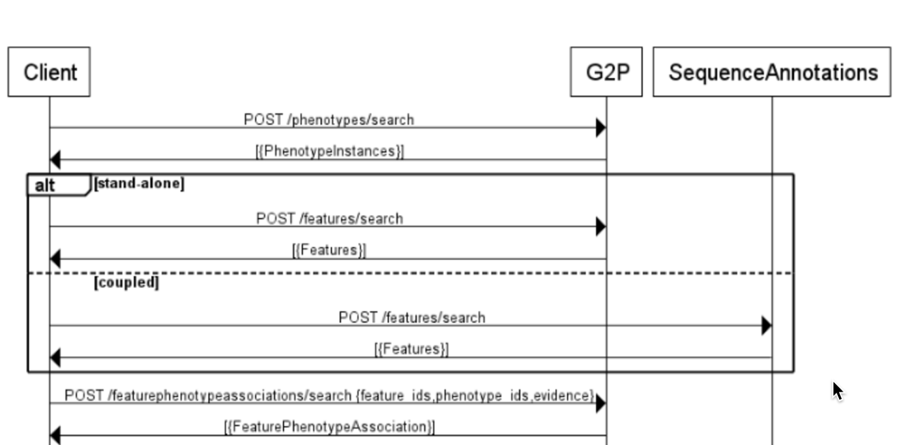
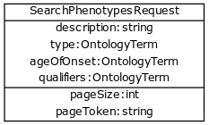
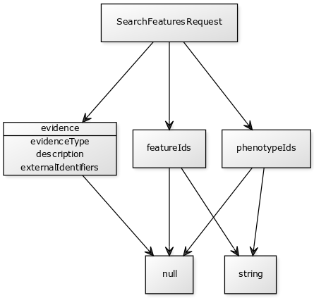

.. _g2p:

*************************
Genotype To Phenotype API
*************************

Summary
=======

This API allows users to search for genotype-phenotype
associations in a GA4GH datastore. The user can search for associations
by building queries composed of features, phenotypes, and/or evidence
terms. The API is designed to accommodate search terms specified as
either a string, external identifier, ontology identifier, or as an
'entity' (See Data Model section). These terms are combined as an
``AND`` of ``(feature && phenotype && evidence)``. This flexibility in
the schema allows a variety of data to be stored in the database and
allows users to express a wide range of queries.

Users will receive an array of associations as a response. Associations
contain description and environment fields in addition to the relevant
feature, phenotype, and evidence fields for that instance of
association.

Multiple server collation - Background
--------------------------------------

G2P servers are planned to be implemented in three different contexts:

-  As a wrapper around standalone local G2P "knowledge bases" (eg
   Monarch, CiVIC,etc). Important considerations are the API needs to
   function independently of other parts of the API and separately from
   any specific omics dataset. Often, these databases are not curated
   with complete Feature fields (referenceName, start, end, strand)

.. figure:: https://cloud.githubusercontent.com/assets/47808/14397288/6743ed28-fd91-11e5-9329-66012b722141.png
   :alt: image

-  Coupled with sequence annotation and GA4GH datasets. Clients will
   want implementation specific featureId/genotypeId to match and
   integrate with the rest of the APIs.

.. figure:: https://cloud.githubusercontent.com/assets/47808/14397306/7ad8bb70-fd91-11e5-9295-85c7034ce544.png
   :alt: image

-  Operating in concert with other instances of g2p servers where the
   client's loosely federated query is supported by heterogeneous
   server. Challenges: Normalizing API behavior across implementations
   (featureId for given region different per implementation)

.. figure:: https://cloud.githubusercontent.com/assets/47808/14397316/8a268b8e-fd91-11e5-907d-441fca3450cb.png
   :alt: image

Approach
--------

We based our original work on the model captured in `ga4gh/schemas
commit of Jul 30,
2015 <https://github.com/ga4gh/schemas/tree/be171b00a5f164836dfd40ea5ae75ea56924d316>`__.
This version of the schema predates the `separated genotype to phenotype
files from
baseline <https://github.com/ga4gh/schemas/commit/846b711fdcf544bf889cc7dbab19c6c48e9a9428>`__.
After on review of the schemas and code, the team had feedback about
separation of responsibility in the original API. The API was refactored
to separate the searches for genotype, phenotype, feature and
associations.

Data Model
----------

The cancer genome database `Clinical Genomics Knowledge
Base <http://nif-crawler.neuinfo.org/monarch/ttl/cgd.ttl>`__ published
by the Monarch project was the source of Evidence.

.. figure:: https://cloud.githubusercontent.com/assets/47808/9338065/a0a84b8e-4597-11e5-82ed-65d7b9f3ae97.png
   :alt: image

Intent: The GA4GH Ontology schema provides structures for unambiguous
references to ontological concepts and/or controlled vocabularies
within Protocol Buffers. The structures provided are not intended for
de novo modeling of ontologies, or representing complete ontologies
within Protocol Buffers. References to e.g. classes from external
ontologies or controlled vocabularies should be interpreted only in
their original context i.e. the source ontology.

Due to the flexibility of the data model, users have a number of options
for specifying each query term
`feature <https://github.com/ga4gh/schemas/blob/be171b00a5f164836dfd40ea5ae75ea56924d316/src/main/resources/avro/genotypephenotypemethods.avdl#L105>`__,
`phenotype <https://github.com/ga4gh/schemas/blob/be171b00a5f164836dfd40ea5ae75ea56924d316/src/main/resources/avro/genotypephenotypemethods.avdl#L108>`__,
and
`evidence <https://github.com/ga4gh/schemas/blob/be171b00a5f164836dfd40ea5ae75ea56924d316/src/main/resources/avro/genotypephenotypemethods.avdl#L111>`__.

API
---

The G2P schemas define several endpoints broken into two entity searches
and an association search.

A feature or phenotype can potentially be represented in increasing
specificity as either [a string, an ontology identifier, an external
identifier, or as a feature 'entity']. One criticism of the previous API
is that it was overloaded, violating the design goal of separation of
concerns. Specifically it combines the search for evidence with search
for features & search for genotypes.

The refactored API moves search, alias matching and external identifiers
lookup to dedicated end points. To separate concens, a client performs
the queries for evidence in two steps: first find the desired entities
and then use those enitity identifiers to narrow the search for
evidence.

Additionally the API supports two implementation styles: integrated and
standalone.

Entity Searches
~~~~~~~~~~~~~~~

-  ``/features/search``

   -  Given a SearchFeaturesRequest, return matching *features* in the
      ``current 'omics dataset``. Intended for sequence annotation and
      GA4GH datasets.

-  ``/phenotypes/search``

   -  Given a SearchPhenotypesRequest, return matching *phenotypes* in
      the in the ``current g2p dataset.``

Association Search
~~~~~~~~~~~~~~~~~~

-  ``/featurephenotypeassociations/search``

   -  Given a SearchGenotypePhenotypeRequest, return matching *evidence
      associations* in the ``current g2p dataset.``

Usage
-----

1. As a GA4GH client, use entity queries for the genotypes and
   phenotypes you are interested in.
2. Create an association search using the entity identifiers from step
   1.
3. Repeat 1-2 as necessary, collating responses on the client.

Many types rely heavily on the concept of an
`OntologyTerm <https://github.com/ga4gh/schemas/blob/be171b00a5f164836dfd40ea5ae75ea56924d316/src/main/resources/avro/ontologies.avdl#L10>`__
(see end of document for discussion on usage of OntologyTerms).

Implementation
--------------

.. figure:: https://cloud.githubusercontent.com/assets/47808/15920813/d70195a0-2dd1-11e6-9c74-ba552735404d.png
   :alt: image

Source Code
~~~~~~~~~~~

-  `Front
   End <https://github.com/ga4gh/server/blob/g2p/ga4gh/frontend.py>`__
   '/features/search', '/datasets/<datasetId>/features/search', '/phenotypes/search',
   '/featurephenotypeassociations/search'
-  `Back
   End <https://github.com/ga4gh/server/blob/g2p/ga4gh/backend.py>`__
   'runSearchFeatures', 'runSearchGenotypePhenotypes', 'runSearchPhenotypes',
   'runSearchGenotypes'
-  `Datamodel <https://github.com/ga4gh/server/blob/g2p/ga4gh/datamodel/genotype_phenotype.py>`__
   'getAssociations'
   `Datamodel <https://github.com/ga4gh/server/blob/g2p/ga4gh/datamodel/genotype_phenotype_featureset.py>`__
   'getAssociations' (Features)

Tests
~~~~~

-  `End to
   End <https://github.com/ga4gh/server/blob/g2p/tests/end_to_end/test_g2p.py>`__

**Help Wanted:** Any or all use cases and scenarios

Acceptance
~~~~~~~~~~

-  Submittal of 3 simultaneous pull-requests for server, schema and
   compliance repositories
-  2 +1s for each repository from outside the development team
-  Additional 3 day review for schemas

API Details and Examples
------------------------

``/phenotypes/search``
~~~~~~~~~~~~~~~~~~~~~~

Terms within a query are combined via AND e.g

::

    request = "phenotype": { description:"AML",  "ageOfOnset": {"id": "http://purl.obolibrary.org/obo/HP_0003581"}}

    is transformed by the server to:

    query = (description="AML" and ageOfOnset="http://purl.obolibrary.org/obo/HP_0003581")

Items in the qualifiers array are OR'd together. For example, severe or
abnormal:

::

    request = ... "phenotype": { description:"AML",  "qualifiers": [{"id": "http://purl.obolibrary.org/obo/PATO_0000396"},{"id":"http://purl.obolibrary.org/obo/PATO_0000460"}] } ....

    is transformed by the server to:

    query = (description="AML" and (qualifier = "http://purl.obolibrary.org/obo/PATO_0000460" or qualifier = "http://purl.obolibrary.org/obo/PATO_0000460"))

The service returns a list of matching PhenotypeInstances.

Examples:Phenotype Lookup
^^^^^^^^^^^^^^^^^^^^^^^^^

Q: I have a Disease ontology id ("OBO:OMIM\_606764").

Use an OntologyTerm.

::

    request = { ...  "type": {"id": "http://purl.obolibrary.org/obo/OMIM_606764"}  .... }

The system will respond with phenotypes that match on OntologyTerm.id

Q: I have a phenotype id (“p12345”) Create an PhenotypeQuery using id
field.

::

    request = ...  {  "id": "p12345"  } ....

The system will respond with phenotypes that match on
PhenotypeInstance.id

Q: I have an ontology term for a phenotype (HP:0001507, 'Growth
abnormality' )

Use an OntologyTerm.

::

    request = ...  {  "type": {"id": "http://purl.obolibrary.org/obo/HP_0001507"}  } ....

The system will respond with phenotypes that match on OntologyTerm.id

Q: I am only interested in phenotypes qualified with (PATO\_0001899,
``decreased circumference`` ) Create a PhenotypeQuery

::

    request = ...  {  "qualifiers": [{"id": "http://purl.obolibrary.org/obo/PATO_0001899"}] } ....

The system will respond with phenotypes whose qualifiers that match that
ontology 'is\_a'.

Q: I have a disease name "inflammatory bowel disease".

Create an PhenotypeQuery using description field.
``{"description": "inflammatory bowel disease",...}`` The system
responds with Phenotypes that match on OntologyTerm.description Note
that you can wildcard description. ``{"description": ".*bowel.*",...}``
`Supported
regex <https://www.w3.org/TR/xpath-functions/#regex-syntax>`__

--------------

``/features/search``
~~~~~~~~~~~~~~~~~~~~~

This endpoint is provided to serve features/variants/etc hosted by a g2p
dataset when it is deployed independently of the sequenceAnnotations
API. The request and response payloads are identical to
``/datasets/<datasetId>/features/search``.

Terms within a query are combined via AND e.g:

::

    request = { "name":"KIT",  "referenceName": "hg38" }

    becomes

    query = (name="KIT" and referenceName ="hg38")

The service returns a list of matching Features.

Examples:Genotype Lookup
^^^^^^^^^^^^^^^^^^^^^^^^

Note:  since we have switched to relying on the features/search API,
external identifier queries have been deprecated. Refer to features/search documentation.

Q: I have a SNPid ("rs6920220"). Create an External Identifier Query.

``{… {"ids": [{"identifier": "rs6920220", "version": "*", "database": "dbSNP"}]},  … }``

The endpoint will respond with features that match on external
identifier. Multiple identifiers are OR'd together.

Q: I have an identifier for BRCA1 ``GO:0070531`` how do I query for
feature? Create an OntologyTerm query:
``{…   {"type": {"id":"http://purl.obolibrary.org/obo/GO_0070531"},  … }``

The endpoint will respond with features that match on that term.

Q: I only want somatic variant features ``SO:0001777`` how do I limit
results? Specify featureType
``{… {"featureType":"http://purl.obolibrary.org/obo/SO_0001777",  … }``
The endpoint will respond with features that match on that type.

--------------

``/features/search``
~~~~~~~~~~~~~~~~~~~~

See sequence annotations `documentation <sequence_annotations.html>`__.

--------------

``/featurephenotypeassociations/search``
~~~~~~~~~~~~~~~~~~~~~~~~~~~~~~

The endpoint accepts a SearchGenotypePhenotypeRequest POST. The request
may contain a feature, phenotype, and/or evidence, which are combined as
a logical AND to query the underlying datastore. Missing types are
treated as a wildcard, returning all data. The genotype and phenotype
fields are either null or a list of identifiers returned from the entity
queries. The evidence query object allows filtering by evidence type.

   http://yuml.me/edit/024cf70f

The SearchGenotypePhenotype search is simplified. Features and
Phenotypes are expressed as a simple array of strings. Evidence can be
queried via the new EvidenceQuery.

The response is returned as a list of associations.

.. figure:: https://raw.githubusercontent.com/ohsu-computational-biology/schemas/a44e67210724af58041fa83c898b1701b53ca84f/doc/source/_static/g2p_response.png
   :alt:

*Implementation Guidance: Results*
^^^^^^^^^^^^^^^^^^^^^^^^^^^^^^^^^^

Q: I need a place to store publication identifiers or model machine
learning and statistical data.

The "info" key value pair addition to Evidence.

::

        {
          "evidenceType": {
            "sourceName": "IAO",
            "id": "http://purl.obolibrary.org/obo/IAO_0000311",
            "sourceVersion": null,
            "term": "publication"
          },
          "info": {"source": ["PMID:21470995"]},
          "description": "Associated publication"
        }
        {
          "evidenceType": {
            "sourceName": "OBI",
            "id": "http://purl.obolibrary.org/obo/OBI_0000175",
            "sourceVersion": null,
            "term": "p-value"
          },
          "info": {"p-value": ["1.00e-21"]}
          "description": "Associated p-value"
        },
        {
          "evidenceType": {
            "sourceName": "OBCS",
            "id": "http://purl.obolibrary.org/obo/OBCS_0000054",
            "sourceVersion": null,
            "term": "odds ratio"
          },
          "description": "1.102"
        }

Use cases
---------

1) As a clinician or a genomics researcher, I may have a patient with
   Gastrointestinal stromal tumor, GIST, and a proposed drug for
   treatment, imatinib. In order to identify whether the patient would
   respond well to treatment with the drug, I need a list of features
   (e.g. genes) which are associated with the sensitivity of GIST to
   imatinib. Suppose I am specifically interested in a gene, *KIT*,
   which is implicated in the pathogenesis of several cancer types. I
   could submit a query to ``/featurephenotypeassociations/search`` with GIST as
   the phenotype, *KIT* as the feature, and
   ``clinical study evidence <http://purl.obolibrary.org/obo/ECO_0000180>``\ \_\_
   as the evidence.

In response, I will receive back a list of associations involving GIST
and *KIT*, which I can filter for instances where imatinib is mentioned.
URI's in the ``associations`` field could - hypothetically - be followed
to discover that
``GIST patients with wild-type *KIT* have decreased sensitivity to therapy with imatinib <http://www.ncbi.nlm.nih.gov/pmc/articles/PMC2651076/>``\ \_\_.

If I left both the ``feature`` and ``evidence`` fields as ``null``, I
would receive back all associations which involve GIST as a phenotype.

2) As a non-Hodgkin's lymphoma researcher, I may know that the gene
   *CD20* has an abnormal expression in
   ``Hodgkin's lymphoma <http://purl.obolibrary.org/obo/DOID_8567>``\ **.
   I might be interested in knowing whether *CD20* also has an abnormal
   expression in
   ``non-Hodgkin lymphoma <http://purl.obolibrary.org/obo/DOID_0060060>``**.
   Therefore I could perform a query with *CD20* as a feature,
   non-Hodgkin's lymphoma as a phenotype, and
   ``RNA sequencing <http://purl.obolibrary.org/obo/OBI_0001177>``\ \_\_
   as the evidence type.

3) As a genetic counselor, I may be wondering if a mutation in one of my
   clients' genes has ever been associated with a disease. I could then
   do a query based on the gene name as the feature and
   ``disease <http://purl.obolibrary.org/obo/DOID_4>``\ \_\_ as the
   phenotype.

For specifics of the json representations, please see the
``server <https://github.com/ga4gh/server>``\ \_\_ and
``compliance <https://github.com/ga4gh/compliance>``\ \_\_ repositories.

Ontologies
----------

**Usage:** Multiple ontology terms can be supplied e.g. to describe a
series of phenotypes for a specific sample. The OntologyTerm message is not
intended to model relationships between terms, or to provide mappings
between ontologies for the same concept. Should an OntologyTerm be
unavailable, or terms unmapped then an 'annotation' can be provided
which can later be mapped to an ontology term using a service designed
for this. Using OntologyTerm is preferred to using Annotation. Though
annotations can be supplied with related ontology terms if desired. A
use case could be when a free text annotation is very specific and a
more general OntologyTerm is supplied.

:ref:`Read more about Ontology Terms<metadata_ontologies>`

--------------

Directions for future capabilities.
===================================

**Flexible representation of Feature**

-  Q: I need to lookup Feature by proteinName or other external id. How do look them up?
      Currently, sequence annotation's features/search supports search by name or location.
      Future versions should implement lookup by alias/

-  Q: I have results from multiple G2P Servers. How do I collate them across datasets and implementations?
      This is a subject for the investigation as we create a federation of G2P servers.
      The responsibility for collating features and associations across servers.
      One strategy might be to use HGVS' DNA annotation for as a neutral identifier for feature.

**Expanding scope to entities other than Feature**

Consider instead a PhenotypeAssociation which has a wider scope; the
objects it connects and the evidence type determines the meaning of the
association

.. figure:: https://cloud.githubusercontent.com/assets/47808/14397329/99fc7c30-fd91-11e5-8346-e95f97bfb78c.png
   :alt: image
