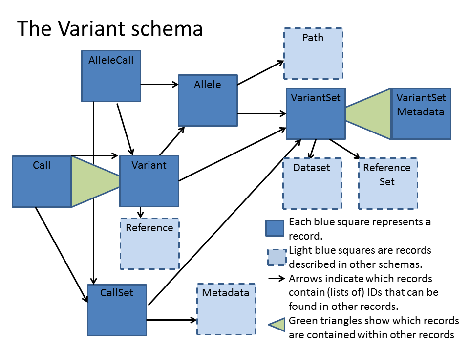

.. _variants:

*******************
Variants API
*******************

For the Variant schema definitions, see the `Variants schema <schemas/variants.html>`_

------------------
Genetic Variants
------------------

Genetic variants are changes in the genome from one individual to the next. Such variants can be more or less common and may have effects on gene regulation
or protein sequences. 

There are three types of variants:

#. Single Nucleotide Polymorphisms (SNPs), which include small insertions and deletions 
#. Copy number variations, which happen when the number of copies of a particular gene or DNA segment varies from one individual to the next.
#. Structural variants, affecting larger genomic regions. This last group is (currently) outside the scope of GA4GH.

To study genetic variants, individual genome sequences are usually compared to a single reference genome, for example `GRCh37`_ in humans.

An individual genome will have many differences with respect to the reference. They might be displayed like so::

    CHROM  POS     REF  ALT  
    20     14370   G      A 
    20     17330   T      A
    20     18302   T      .

Here, the reference sequence has a T at position 18302 in the genome, but the individual has a one nucleotide deletion, 
represented as a period.
These variant versions (G or A, T or .) are also known as alleles.

Many variants are common enough to have a SNP id, a number starting with 'rs' (for Reference SNP). See `dbSNP`_ for details.

Humans are diploid, meaning they have two copies of each chromosome (except X and Y). It is therefore possible to have one copy each of the reference and
alternative alleles in a single individual.

The `Variant Call Format (VCF)`_ is a way of representing allele data for individuals. It includes a coordinate system as shown above, SNP rsIDs if available, 
and one data column per individual that shows the alleles for each variant.
The Variant schema is based on this file format.

.. _GRCh37: http://www.ncbi.nlm.nih.gov/assembly/GCF_000001405.13
.. _dbSNP: http://www.ncbi.nlm.nih.gov/SNP
.. _Variant Call Format (VCF): http://www.1000genomes.org/wiki/analysis/variant%20call%20format/vcf-variant-call-format-version-41

------------------
The Variant Schema
------------------

While the Variant schema is based on VCF, it allows for more versatile interaction with the data. 
Instead of sending whole chromosome or whole genome VCF files, the server can send information on specific
genomic regions instead. And instead of getting all data for an experiment, it is possible to just get details for a single individual.

`EXPLAIN: Will it also be possible to query on e.g. rsID?`

The Variant schema consists of records that each describe part of the data:

`FIXME: Allele and AlleleCall have been removed from Variants, so how does the user retrieve the VCF REF and ALT fields?`

========== ================================================== ==============
Record     | Description                                      VCF equivalent
========== ================================================== ==============
Variant    | Position of genetic difference with respect to   Single line without genotype fields
           | a reference genome 
Allele     | A contiguous piece of sequence that is           **REF** and **ALT** fields
           | present or absent in a sample. 
AlleleCall | Allele call(s) for one variant in one individual First subfield in genotype field
Call	   | Information on AlleleCall			      Remaining subfields in genotype field
CallSet	   | All Variant calls for a single individual        Genotype column
VariantSet | A collection of variants                         VCF file
Metadata   | Information on the flags used                    VCF header
========== ================================================== ==============

For a complete description of all Variant records, see `Variants schema <schemas/variants.html>`_

`EXPLAIN: Where do the Qual, Info, Filter, and Format fields go?`

This is what the VariantSet record looks like::

  record VariantSet {
  /** The UUID of the variant set. */
  string id;

  /** The ID of the dataset this variant set belongs to. */
  string datasetId;

  /**
  The ID of the reference set that describes the sequences used by the variants in this set.
  */
  string referenceSetId;

  /**
  The metadata associated with this variant set. This is equivalent to
  the VCF header information not already presented in first class fields.
  */
  array<VariantSetMetadata> metadata = [];
  }

So this record describes four variables: id, datasetId, referenceSetId, and VariantSetMetadata.

The ``id`` is unique and can be used in other records. For instance, the Variant record has a variable named ``VariantSetId``, which can be used to look up VariantSet records.

``datasetId`` points to the unique ID of a dataset record (defined in the metadata schema).

``referenceSetId`` points to the unique ID of a reference record (defined in the reference schema).

``VariantSetMetadata`` is a special variable that is itself a whole record, described elsewhere. In this case the record is described in the Variants schema but it's also possible to refer to records described in other schemas.

Below is an image of which records contain other records (such as ``VariantSetMetaData``), and which contain IDs that can be used to get information from other records (such as ``variantSetId``). The arrow points `from` the record that lists the ID `to` the record that can be identified by that ID.

For the complete Variant schema definition, see the `Variants schema <schemas/variants.html>`_

