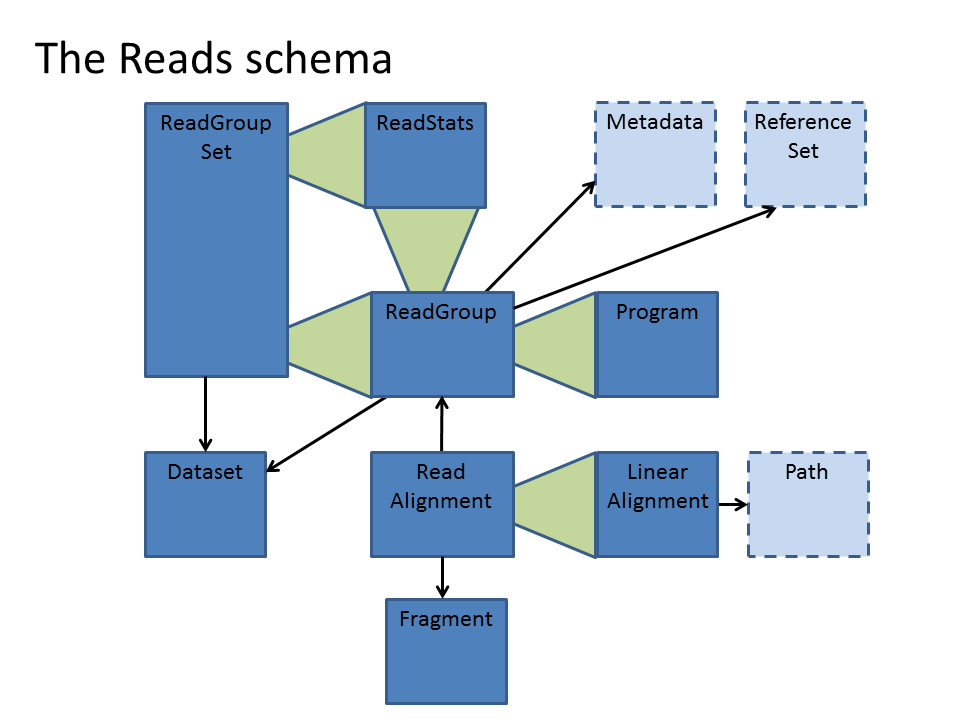

.. _reads:

*****************
Reads API
*****************

For the Reads schema definitions, see `Reads schema <schemas/reads.html>`_

------------
Short Reads
------------

High throughput genome and transcriptome sequencing produces millions of short (50-200 nucleotide) sequences.
These sequences are usually referred to as reads. Reads can be produced from:

#. Complete genomes. These reads can be used to piece together the full genome of an individual.
#. Exomes. These reads are derived from just the gene regions in the genome (in humans this is a reduction of >97%)
#. Transcriptomes. Here, the RNA that gets transcribed from the genomic DNA is sequenced, representing only the genes that are active in the tissue that was sampled. Transcriptomes differ from tissue to tissue and can be used to determine differences between tumors and their surrounding tissues.

Reads are usually mapped to a reference genome, for example `GRCh37`_ in humans.

These alignments can be displayed like so::

    ID      CHROM  POS    CIGAR   SEQUENCE  
    read1   chr1   234    10M     GACAGTCCCA  
    read2   chr14  1456   10M     AAAGATTGAC  
    read3   chrX   2837   7M2I1M  TGGGACTCTA  

In this format, the CIGAR string shows how well the read matches the genome: read1 is identical to the genome sequence over all its
10 bases: 10M. The first seven bases of read3 match the genome (7M), but then it has a 2 base insertion (2I), followed by another 1 base match (1M).

The `SAM/BAM Format`_ is a way of representing read data. It includes the fields shown above as well as information on read orientation, sequence quality, and optional fields. The format also allows for reads that do not align to the genome, by leaving the reference sequence ID, position, and cigar fields empty.

Sam is a human readable format, bam is a condensed binary format. The formats can be readily converted to each other.

.. _SAM/BAM Format: https://samtools.github.io/hts-specs/SAMv1.pdf

.. _GRCh37: http://www.ncbi.nlm.nih.gov/assembly/GCF_000001405.13

------------------
The Reads Schema
------------------

While the Reads schema is based on the SAM format, it allows for more versatile interaction with the data. 
Instead of sending whole chromosome or whole genome files, the server can send information on specific
genomic regions instead.

The Reads schema consists of records that each describe part of the data:

=============== ============================================ ==================
Record          | Description                                SAM/BAM equivalent
=============== ============================================ ==================
ReadAlignment   | One alignment for one read                 A single line in a file
ReadGroup       | A group of read alignments                 Complete file
ReadGroupSet    | Collecton of ReadGroups that map to the    Files from one sequencing run
                | same genome
ReadStats       | Counts of aligned and unaligned reads	     Samtools flagstats on a file
                | for a ReadGroup or ReadGroupSet
LinearAlignment | Mapping of a read to a reference           One CIGAR string
Program         | Software version and parameters that were  PN, CL tags in SAM header
                | used to align reads to the genome
Fragment        | *ill defined*
=============== ============================================ ==================

For a complete description of all Reads records, see `Reads schema <schemas/reads.html>`_

Records can contain other records, for instance ReadStats is contained in ReadGroup and ReadGroupSet.
Each record is made up of a number of fields that describe the data.

This is what the ReadGroupSet record looks like::

  record ReadGroupSet {
  /** The UUID of the ReadGroupSet.*/
  string id;

  /** The ID of the Dataset this read group set belongs to. 
  union { null, string } datasetId = null;

  /** The read group set name. 
  union { null, string } name = null;

  /** The ReadStats statistical data on reads in this read group set. 
  union { null, ReadStats } stats = null;

  /** The ReadGroups that make up this read group set. */
  array<ReadGroup> readGroups = [];

  }

`FIXME: Most of these values should not be null`

So this record describes five variables: id, datasetId, name, stats, and readGroups.

  * The ``id`` is unique and can be used in other records.
  * ``dataSetId`` and ``name`` point to the unique IDs of a dataset record and a ReadGroup record, respectively.
  * ``stats`` is a special variable that is itself a whole ``ReadStats`` record.
  * ``readGroups`` is similar to stats but contains multiple ReadGroup records instead of just one.

The image below shows which Reads records contain other records (represented by green triangles), and which contain IDs that can be used to get information from other records (arrows). The arrow points `from` the record that lists the ID `to` the record that can be identified by that ID. Records are represented by blue rectangles; dotted lines indicate records defined in other schemas.

 
